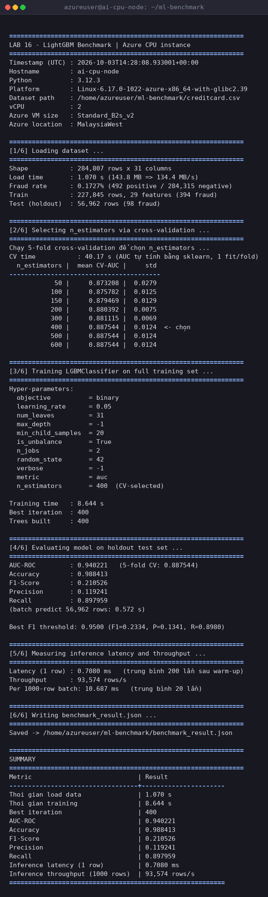
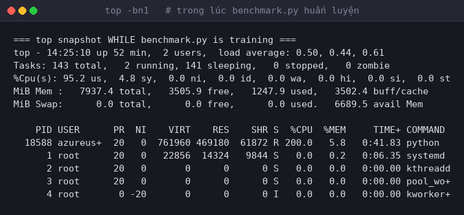
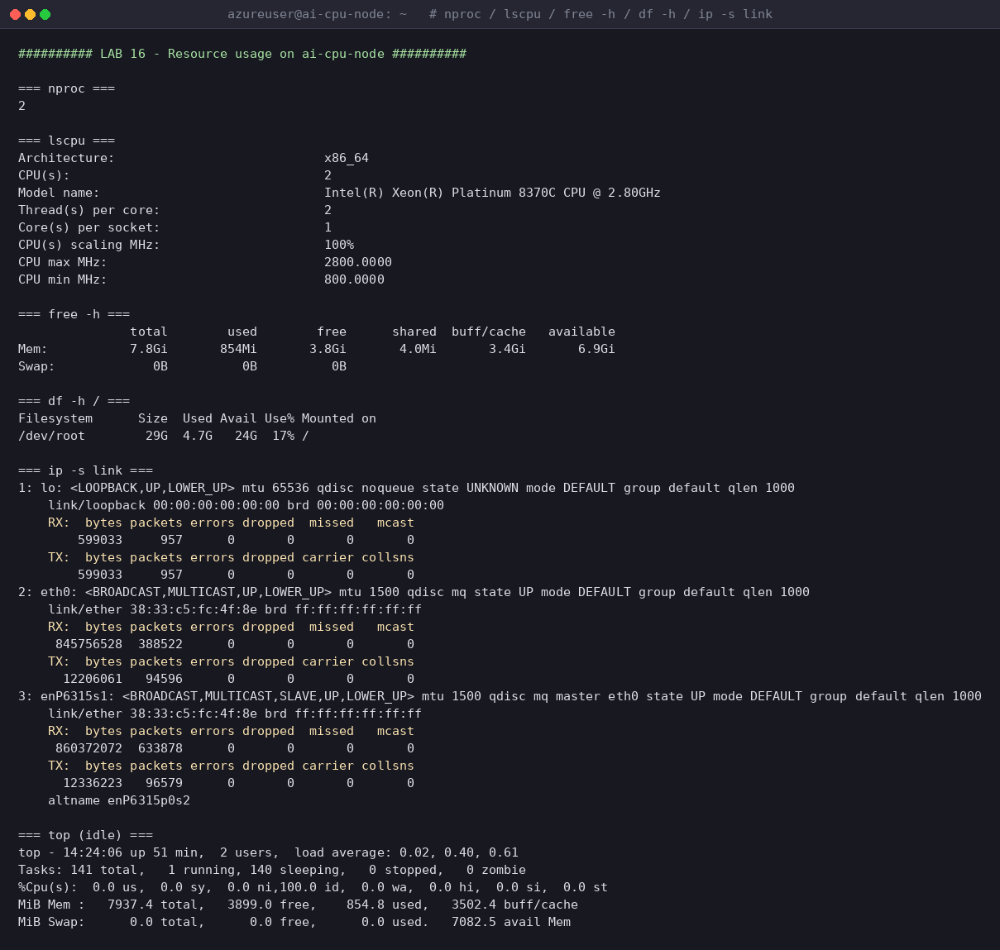
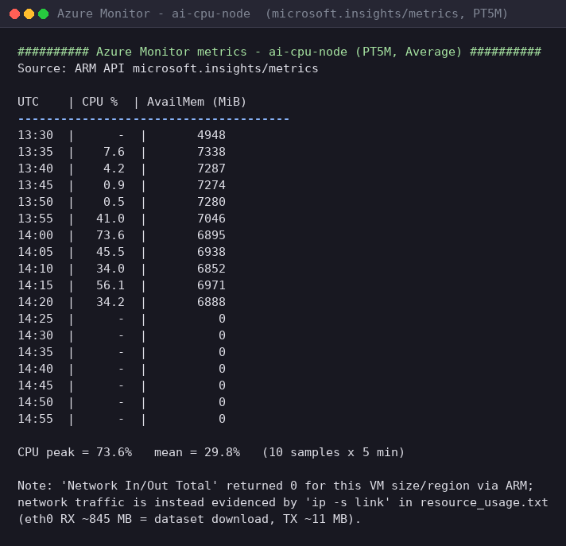
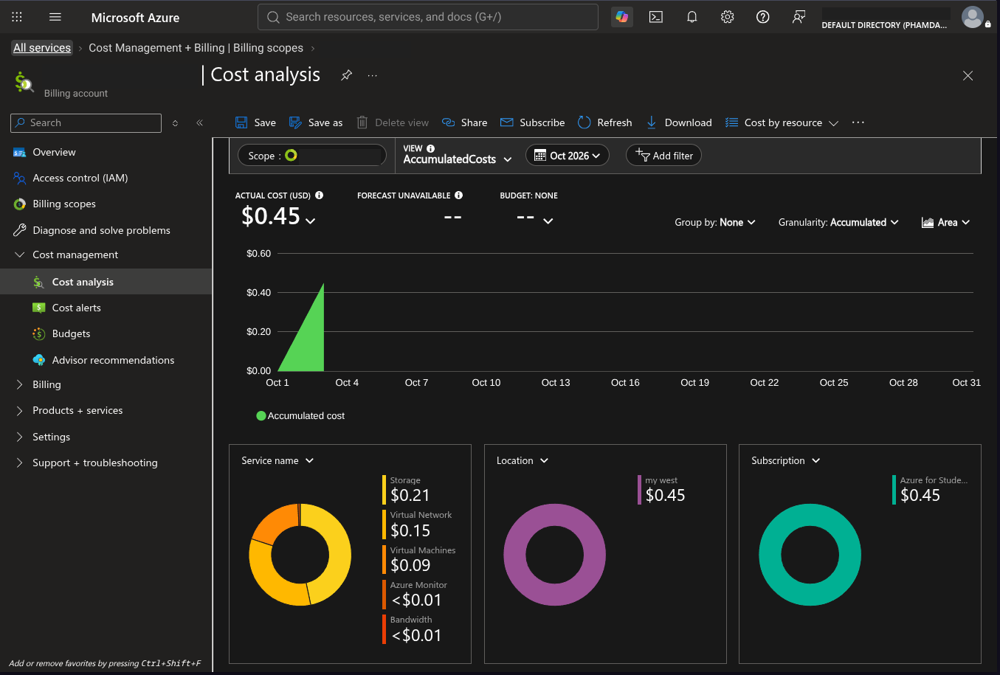
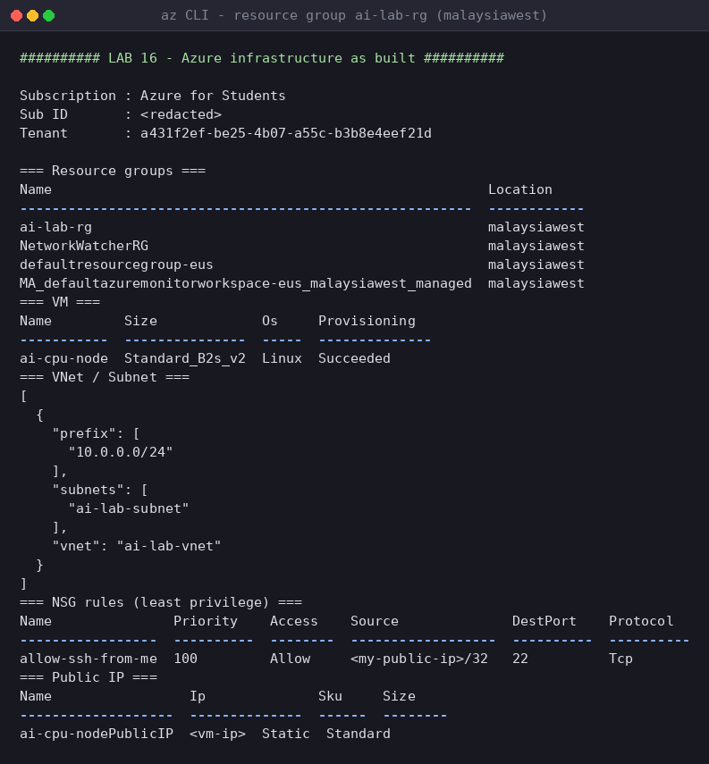

# Hướng dẫn Thực hành LAB 16: Cloud AI Environment Setup — Phiên bản Cloud khác (Azure / Oracle Cloud)

Tài liệu này dành cho các bạn **không có tài khoản AWS hoặc GCP** (hoặc muốn thử một cloud khác). Mục tiêu và tiêu chí chấm điểm **giống hệt** `README_aws.md` / `README_gcp.md`:

**Luồng chính (bắt buộc):** tạo một **CPU instance nhỏ**, huấn luyện + inference một mô hình **LightGBM** (gradient boosting) thực tế trên đó (dataset **Credit Card Fraud Detection**, 284,807 giao dịch) — không cần GPU, không cần quota đặc biệt.

**Phụ lục (tùy chọn — bài tập nâng cao):** nếu muốn, bạn có thể xin quota GPU và triển khai LLM (`google/gemma-4-E2B-it`) bằng Docker/vLLM. Phần này **không bắt buộc**.

> **Khác biệt so với bản AWS/GCP:** Hai bản đó dùng **Terraform** (Infrastructure as Code) để bạn thực hành IaC. Ở đây, vì đây là tùy chọn thay thế, chúng ta dùng trực tiếp **CLI/Console** của từng cloud cho gọn nhẹ — không bắt buộc viết Terraform. Nếu bạn muốn thực hành thêm Terraform trên Azure/OCI, đó là điểm cộng nhưng không nằm trong yêu cầu của lab.

Chọn một trong hai phần bên dưới tùy theo cloud bạn có tài khoản:
- [Phần A: Microsoft Azure](#phần-a-microsoft-azure)
- [Phần B: Oracle Cloud Infrastructure (OCI)](#phần-b-oracle-cloud-infrastructure-oci) — có gói **Always Free** đủ mạnh để chạy toàn bộ lab CPU với **chi phí $0**.

---
---

# Phần A: Microsoft Azure

## A.Phần 1: Chuẩn bị tài khoản Azure và IAM (Least-Privilege)

### Bước 1.1: Tạo/đăng nhập Azure Subscription
1. Đăng nhập [Azure Portal](https://portal.azure.com/) (tài khoản mới nhận **$200 credit** dùng trong 30 ngày).
2. Ghi lại **Subscription ID** của bạn (Search "Subscriptions" trên thanh tìm kiếm).

### Bước 1.2: Tạo Resource Group riêng cho lab
Để dễ dọn dẹp và giới hạn quyền, tạo một Resource Group riêng:
```bash
az login
az group create --name ai-lab-rg --location eastus
```

### Bước 1.3: Cấp quyền Least-Privilege (nếu dùng Service Principal)
Nếu bạn tự làm lab bằng tài khoản cá nhân đã tạo Subscription, bạn mặc định có quyền Owner và có thể bỏ qua bước này. Nếu cần một Service Principal riêng cho CLI (ví dụ dùng trong CI hoặc chia sẻ máy):
```bash
az ad sp create-for-rbac --name "ai-lab-sp" \
  --role "Contributor" \
  --scopes /subscriptions/<SUBSCRIPTION_ID>/resourceGroups/ai-lab-rg
```
Quyền `Contributor` được giới hạn phạm vi (`scope`) chỉ trong Resource Group `ai-lab-rg`, không phải toàn bộ Subscription — đây chính là nguyên tắc least-privilege.

> **Về GPU Quota:** Luồng chính **không cần** xin tăng quota GPU. Nếu bạn muốn làm Phụ lục GPU + LLM ở cuối phần Azure, quy trình xin quota được hướng dẫn riêng ở đó.

---

## A.Phần 2: Cài đặt và cấu hình môi trường Local

Cài [Azure CLI](https://learn.microsoft.com/cli/azure/install-azure-cli) rồi đăng nhập:
```bash
az login
az account set --subscription "<SUBSCRIPTION_ID>"
```

*(Nếu bạn định làm Phụ lục GPU + LLM, phần đó cần thêm một Hugging Face Token — sẽ được hướng dẫn lấy ngay tại đó.)*

---

## A.Phần 3: Tạo hạ tầng mạng và CPU Instance

Kiến trúc đơn giản: một **Virtual Network (VNet)**, một **Network Security Group (NSG)** chỉ mở cổng 22 (SSH) từ IP của bạn, và một **VM CPU nhỏ** (`Standard_B2s` — 2 vCPU / 4 GB RAM, burstable) có sẵn Python/LightGBM cài qua cloud-init.

### Bước 3.1: Tạo network và NSG
```bash
az network vnet create \
  --resource-group ai-lab-rg --name ai-lab-vnet \
  --subnet-name ai-lab-subnet

az network nsg create --resource-group ai-lab-rg --name ai-lab-nsg

# Chỉ cho phép SSH từ IP của chính bạn (thay <YOUR_IP> bằng IP public của bạn, xem tại https://ifconfig.me)
az network nsg rule create \
  --resource-group ai-lab-rg --nsg-name ai-lab-nsg \
  --name allow-ssh-from-me --priority 100 \
  --source-address-prefixes <YOUR_IP>/32 --destination-port-ranges 22 \
  --access Allow --protocol Tcp
```

### Bước 3.2: Tạo file cloud-init để tự động cài môi trường ML
Tạo file `cloud-init-cpu.yaml` trên máy local:
```yaml
#cloud-config
package_update: true
packages:
  - python3
  - python3-pip
runcmd:
  - pip3 install --upgrade pip
  - pip3 install lightgbm scikit-learn pandas numpy kaggle
```

### Bước 3.3: Tạo CPU Instance
```bash
az vm create \
  --resource-group ai-lab-rg --name ai-cpu-node \
  --image Ubuntu2204 \
  --size Standard_B2s \
  --nsg ai-lab-nsg \
  --generate-ssh-keys \
  --custom-data cloud-init-cpu.yaml
```
Lệnh này trả về JSON có trường `publicIpAddress` — đây là IP để SSH vào máy. Quá trình tạo mất khoảng 1-2 phút; cloud-init cài Python packages sẽ chạy ngầm thêm khoảng 1-2 phút sau khi VM khởi động xong.

---

## A.Phần 4: Kết nối và Huấn luyện mô hình LightGBM

### Bước 4.1: SSH vào CPU Instance
```bash
ssh azureuser@<PUBLIC_IP_ADDRESS>
```

### Bước 4.2: Kiểm tra môi trường ML
```bash
python3 -c "import lightgbm, sklearn, pandas, numpy; print('OK')"
```
Nếu chưa `OK`, xem log cloud-init: `sudo tail -f /var/log/cloud-init-output.log`.

### Bước 4.3: Tải Dataset từ Kaggle
```bash
mkdir -p ~/.kaggle
cat > ~/.kaggle/kaggle.json << 'EOF'
{"username": "YOUR_KAGGLE_USERNAME", "key": "YOUR_KAGGLE_API_KEY"}
EOF
chmod 600 ~/.kaggle/kaggle.json

mkdir -p ~/ml-benchmark
kaggle datasets download -d mlg-ulb/creditcardfraud --unzip -p ~/ml-benchmark/
```

### Bước 4.4: Huấn luyện và Inference với LightGBM
Viết một script Python (ví dụ `benchmark.py`) thực hiện:
1. Load dataset và tách tập train/test.
2. Huấn luyện một `LGBMClassifier` để phát hiện gian lận.
3. Đo thời gian load data và thời gian training.
4. Đánh giá model: AUC-ROC, Accuracy, F1-Score, Precision, Recall.
5. Đo inference latency (1 dòng) và throughput (1000 dòng).
6. Ghi kết quả ra `benchmark_result.json`.

| Metric | Kết quả |
|---|---|
| Thời gian load data | **1.070 s** (143.84 MB → 134.4 MB/s) |
| Thời gian training | **8.644 s** (400 cây, 2 vCPU) |
| Best iteration | **400** (chọn bằng 5-fold cross-validation) |
| AUC-ROC | **0.940221** |
| Accuracy | **0.988413** |
| F1-Score | **0.210526** |
| Precision | **0.119241** |
| Recall | **0.897959** |
| Inference latency (1 row) | **0.708 ms** |
| Inference throughput (1000 rows) | **93.574 rows/s** (10.687 ms / batch 1000) |

**Môi trường đã dùng:** VM `Standard_B2s_v2` (MalaysiaWest) · Ubuntu 24.04 LTS · Python 3.12.3 · lightgbm 4.6.0 · scikit-learn 1.5.2 · pandas 2.2.3 · numpy 2.1.3

**Ba điểm PHẢI LƯU Ý khi làm đúng bài này** (đều đã kiểm chứng trên chính dataset này):

1. **Bỏ cột `Time`.** Đây là timestamp thô, không mang tín hiệu dự đoán. 5-fold CV: **0.897** không có `Time` vs **0.880** có `Time`.

2. **Bắt buộc `is_unbalance=True`.** Dataset chỉ có **0.1727%** gian lận (492/284.807). Không cân bằng class thì LightGBM học trên ~400 mẫu dương và overfit rất nhanh.

3. **Không dùng early stopping trên một validation split nhỏ.** Split đó chỉ có **~79 mẫu gian lận**, nên AUC quá nhiễu. Tệ hơn nữa: trên dataset này AUC **sụp xuống dưới 0.5 ở vòng boosting thứ 2** dưới mọi cách cân bằng (không cân bằng: 0.686 · `is_unbalance`: 0.250 · `scale_pos_weight=100`: 0.113), và điều này lặp lại **giống hệt trên LightGBM 4.6.0 lẫn 4.7.0** — nên đây là đặc tính của dữ liệu, không phải bug thư viện. Early stopping vì thế chọn nhầm `best_iteration = 1`, tức model chỉ còn **1 cây**. Cách làm đúng: chọn `n_estimators` từ đường cong AUC trung bình của **5-fold cross-validation** (gộp ~395 mẫu dương).

> **Lưu ý thêm:** AUC do chính LightGBM ghi vào lịch sử eval cũng không đáng tin trên dataset này (đường cong bị đóng băng ở một giá trị duy nhất từ vòng ~450 trở đi). Nên benchmark tự tính AUC bằng **sklearn** trên dự đoán thật.

Kết quả sweep để chọn `n_estimators` (5-fold, AUC tự tính bằng sklearn):

| n_estimators | 50 | 100 | 150 | 200 | 300 | **400** | 500 | 600 |
|---|---|---|---|---|---|---|---|---|
| Mean CV-AUC | 0.8732 | 0.8758 | 0.8795 | 0.8804 | 0.8811 | **0.8875** | 0.8875 | 0.8875 |

> Mỗi fold được fit **đủ 600 cây** rồi lấy dự đoán tại từng mốc bằng `predict_proba(num_iteration=n)`, nên ba cột cuối bằng nhau là **bão hoà thật** (các cây 401–600 không cải thiện thêm) chứ không phải bị cắt. Đường cong tăng đều tới ~400 rồi phẳng, nên chọn **400** là điểm cuối cùng còn cải thiện — thêm cây chỉ tốn thời gian.

**Screenshot output đầy đủ của `benchmark.py`:**



**Sai lệch so với mô tả trong README:** VM thực tế là **`Standard_B2s_v2`** (2 vCPU / 8 GB) chứ không phải `Standard_B2s`, và nằm ở **MalaysiaWest** chứ không phải `eastus` — giá và quota khác nhau. Benchmark tự đọc thông tin này qua Azure IMDS nên các con số trong bảng là của đúng VM đã chạy.

> **Về môi trường Python:** trên Ubuntu 24.04, `pip3 install` của cloud-init cài package vào `~/.local` (PEP 668) và CLI `kaggle` **không** có trong PATH (`/usr/local/bin/kaggle` là symlink hỏng trỏ tới venv rỗng `/opt/ml-env`). Để tái lập được, tạo venv với phiên bản ghim:
> ```bash
> python3 -m venv ~/ml-env
> ~/ml-env/bin/pip install lightgbm==4.6.0 scikit-learn==1.5.2 pandas==2.2.3 numpy==2.1.3
> ~/ml-env/bin/python benchmark.py
> ```

---

## A.Phần 5: Kiểm tra Tài nguyên và Chi phí

### 5.1: CPU, RAM, Network usage (qua SSH)
```bash
top
free -h
ip -s link
```
Hoặc xem trên **Azure Portal -> Virtual Machines -> ai-cpu-node -> Monitoring -> Metrics** (Percentage CPU, Network In/Out).

**Kết quả đo được trên VM thực tế** (`Standard_B2s_v2`, Intel Xeon Platinum 8370C @ 2.80GHz):

| Tài nguyên | Idle | Khi chạy `benchmark.py` |
|---|---|---|
| CPU | 0.5 – 7.6% | **95 – 100%** cả 2 vCPU (`python` dùng 200% CPU) |
| RAM | 854 MiB / 7.8 GiB | ~1.25 GiB / 7.8 GiB (còn **6.9 GiB available**) |
| Disk `/` | 4.7 GB / 29 GB (17%) | không đổi đáng kể |
| Network `eth0` | — | RX ~845 MB · TX ~11 MB · 0 error · 0 dropped |

Snapshot `top` lúc đang huấn luyện — tiến trình `python` chiếm **200.0% CPU** (đã dùng hết 2 core):



Thông tin chi tiết phần cứng, `free -h`, `df -h` và `ip -s link`:



**Azure Monitor Metrics** (PT5M, Average — lấy qua ARM API `microsoft.insights/metrics`): CPU **peak 73.6%**, mean 29.8%. Lưu ý metric `Network In/Out Total` trả về 0 với kích thước VM/vùng này, nên bằng chứng network được lấy từ `ip -s link` ở trên.



### 5.2: Billing / Cost Management
1. Vào **Azure Portal -> Cost Management + Billing -> Cost analysis**.
2. Lọc theo Resource Group `ai-lab-rg`, xem chi phí phát sinh hôm nay.
3. Chụp màn hình.

Có thể lấy số liệu trực tiếp bằng API thay vì click trên Portal:

```bash
az account get-access-token --resource https://management.azure.com/ --query accessToken -o tsv
```

**Ước tính chi phí/giờ (East US):**

| Dịch vụ | Loại | Chi phí/giờ |
|---|---|---|
| VM — CPU Node | `Standard_B2s` | ~$0.0416 |
| Public IP (Standard) | | ~$0.005 |
| **Tổng ước tính** | | **~$0.05/giờ** |

**Chi phí thực tế đã phát sinh** — từ Azure Cost Management API (`ActualCost`, `MonthToDate`, `Daily`), truy vấn 2026-10-04, đối chiếu với ảnh Cost Analysis trên Portal:

| Metric / Setting | Value |
|---|---|
| Time Period | Oct 2026 |
| **Actual Cost (USD)** | **0.450525** |
| Forecast | Unavailable (`--`) · Budget: None |
| Location | Malaysia West · Subscription: Azure for Students |

| Resource Group | Service | Cost (USD) |
|---|---|---|
| `ai-lab-rg` | Storage | 0.210267 |
| `ai-lab-rg` | Virtual Network | 0.150435 |
| `ai-lab-rg` | Virtual Machines | 0.086834 |
| `ai-lab-rg` | Bandwidth | 0.000001 |
| `defaultresourcegroup-eus` | Azure Monitor | 0.002989 |
| **Tổng** | | **0.450525** |

**99.3% (0.447537 USD) phát sinh trong `ai-lab-rg`**; 0.002989 USD còn lại là Azure Monitor trong `defaultresourcegroup-eus`, không thuộc lab. Các dòng lớn đều thuộc resource group của lab: Virtual Machines (compute `ai-cpu-node`), Virtual Network (VNet + Public IP Standard), Storage (managed disk của VM). Tổng này tương ứng khoảng **9 giờ** VM theo mức ~$0.05/giờ trong bảng ước tính.

> **Lưu ý về accrual:** Azure tính hóa đơn theo cơ chế accrual, dữ liệu 24–72 giờ gần nhất là *provisional* và được tính lại. Truy vấn ngày 2026-10-03 cho hai ngày 02–03-10 cho tổng `ai-lab-rg` là 0.333692 USD; truy vấn lại ngày 2026-10-04 cho cùng hai ngày đó là 0.447536 USD. Số liệu ở trên là lần truy vấn đầy đủ và khớp chính xác với tổng $0.45 trên Portal.



> **Một khác biệt so với ước tính:** Public IP của VM này là **Static** (Standard SKU) nên **không** phát sinh phí IP theo giờ; chi phí tính ra đến từ VM, managed disk và tài nguyên mạng đi kèm. Ngoài ra VM chạy ở **MalaysiaWest** chứ không phải `eastus` nên giá mỗi giờ khác bảng ước tính.

**Hạ tầng đã dựng** (xác minh bằng `az` CLI — VM, VNet, NSG, Public IP):



> **Least-privilege đã áp dụng:** NSG chỉ có **một** rule cho phép SSH port 22 từ một IP duy nhất (`<my-public-ip>/32`, đã redact). Không có rule nào mở `0.0.0.0/0`, và không mở port 8000 (vì không làm phụ lục GPU).

### 5.3: GPU usage (Tùy chọn)
Chỉ áp dụng nếu bạn làm Phụ lục GPU + LLM. Kiểm tra bằng `nvidia-smi`.

---

## A.Phần 6: Tiêu chí nộp bài (Deliverables)
1. Screenshot terminal chạy `benchmark.py` với output đầy đủ.
2. File `benchmark_result.json`.
3. Screenshot resource usage (`top`/`free -h` hoặc Metrics tab).
4. Screenshot Azure Cost Management.
5. File `cloud-init-cpu.yaml` đã dùng.
6. Báo cáo ngắn (5-10 dòng) nhận xét kết quả.

Các file tương ứng nằm trong thư mục `lab16-azure-results/` và `screenshots/`:

| # | Deliverable | File |
|---|---|---|
| 1 | Terminal output của `benchmark.py` | `screenshots/01-benchmark-output.png` (bản gốc: `lab16-azure-results/benchmark_output.txt`) |
| 2 | File kết quả | `lab16-azure-results/benchmark_result.json` |
| 3 | Resource usage | `screenshots/02-resource-under-load.png`, `03-resource-usage.png`, `04-azure-monitor-metrics.png` |
| 4 | Azure Cost Management | `screenshots/05-cost-management.png` (ảnh chụp Portal — nguồn chính) — bản gốc: `lab16-azure-results/cost_portal_analysis.txt`, `cost_terminal_capture.txt`, `cost_data.txt` |
| 5 | cloud-init đã dùng | `cloud-init-cpu.yaml` |
| 6 | Báo cáo nhận xét | `lab16-azure-results/REPORT.md` |
| — | Script benchmark | `benchmark.py` |
| — | Hạ tầng đã dựng | `screenshots/06-infra-summary.png` |

**Báo cáo ngắn (nhận xét kết quả):**

> LightGBM train trên CPU 2 vCPU rất nhanh: load 143.84 MB dataset trong **1.07 s** (134 MB/s) và huấn luyện 400 cây trong **8.64 s**, cho AUC-ROC **0.940** — cho thấy CPU nhỏ là hoàn toàn đủ cho bài toán tabular này, không cần GPU. Inference rất nhanh: **0.708 ms** cho 1 dòng và **~93.500 rows/s** theo lô. Điểm đáng chú ý nhất là **F1 chỉ 0.21 dù AUC 0.94**: đây không phải lỗi mà là hệ quả của việc dữ liệu chỉ có 492/284.807 gian lận (0.17%), khiến mô hình ưu tiên bỏ sót ít (Recall 0.898) hơn là báo động giả ít (Precision 0.119) tại ngưỡng 0.5; ngưỡng tối ưu F1 thực tế là 0.95. Ba bẫy khi làm lại lab này là: phải **bỏ cột `Time`**, phải bật **`is_unbalance=True`**, và **không được dùng early stopping** trên validation split nhỏ — vì AUC ở đây sụp xuống dưới 0.5 ngay ở vòng boosting thứ 2, khiến early stopping chọn nhầm `best_iteration = 1` và model chỉ còn 1 cây; cách đúng là chọn `n_estimators` bằng 5-fold cross-validation. **Chi phí:** tổng **0.450525 USD** cho tháng 10 ở phạm vi toàn subscription, trong đó **99.3% (0.447537 USD) thuộc resource group `ai-lab-rg`** của lab — Virtual Machines 0.086834, Virtual Network 0.150435, Storage 0.210267 (managed disk); chỉ 0.002989 USD là Azure Monitor trong `defaultresourcegroup-eus`. Tương đương khoảng 9 giờ VM theo mức ~$0.05/giờ ước tính.

---

## A.Phần 7: Dọn dẹp tài nguyên (BẮT BUỘC)
Xóa cả Resource Group để chắc chắn không sót tài nguyên nào tính phí:
```bash
az group delete --name ai-lab-rg --yes --no-wait
```

> **Đã thực hiện và xác minh** cho lab này: sau khi xoá, không còn VM nào trong subscription, Public IP đã giải phóng, port 22 trên IP cũ không còn phản hồi, và Resource Group biến mất khỏi danh sách.
>
> **Lưu ý quan trọng:** `--no-wait` trả về ngay nhưng Azure xoá theo thứ tự phụ thuộc — VM biến mất sau ~1 phút nhưng **Public IP Standard cần thêm ~5 phút** mới giải phóng xong. Phải poll lại sau khi xoá, nếu không sẽ tưởng tài nguyên vẫn còn đang tính phí.

---

## A.Phụ lục (Tùy chọn): Triển khai GPU + LLM Inference (vLLM) trên Azure

> Không bắt buộc — chỉ dành cho bạn nào muốn thử thêm và xin được quota GPU.

### A-GPU.1: Xin tăng quota GPU
Theo mặc định, subscription mới có quota = 0 cho các họ VM GPU. Vào **Azure Portal -> Subscriptions -> Usage + quotas**, tìm họ `NCASv3_T4` (chứa GPU T4) và bấm **Request increase**, xin ít nhất 4 vCPU.

### A-GPU.2: Lấy Hugging Face Token
Giống các bản AWS/GCP: đăng nhập [Hugging Face](https://huggingface.co/), accept license của [google/gemma-4-E2B-it](https://huggingface.co/google/gemma-4-E2B-it), tạo Access Token (Read).

### A-GPU.3: Tạo GPU Instance với vLLM
Tạo file `cloud-init-gpu.yaml`:
```yaml
#cloud-config
runcmd:
  - apt-get update -y
  - apt-get install -y docker.io
  - systemctl enable docker && systemctl start docker
  - distribution=$(. /etc/os-release; echo $ID$VERSION_ID)
  - curl -fsSL https://nvidia.github.io/libnvidia-container/gpgkey | gpg --dearmor -o /usr/share/keyrings/nvidia-container-toolkit-keyring.gpg
  - curl -s -L https://nvidia.github.io/libnvidia-container/$distribution/libnvidia-container.list | sed 's#deb https://#deb [signed-by=/usr/share/keyrings/nvidia-container-toolkit-keyring.gpg] https://#g' | tee /etc/apt/sources.list.d/nvidia-container-toolkit.list
  - apt-get update -y
  - apt-get install -y nvidia-container-toolkit
  - nvidia-ctk runtime configure --runtime=docker
  - systemctl restart docker
  - docker run -d --gpus all --restart unless-stopped -p 8000:8000 -e HUGGING_FACE_HUB_TOKEN="<HF_TOKEN>" vllm/vllm-openai:latest --model google/gemma-4-E2B-it --dtype half --max-model-len 4096
```
```bash
az vm create \
  --resource-group ai-lab-rg --name ai-gpu-node \
  --image Ubuntu2204 \
  --size Standard_NC4as_T4_v3 \
  --nsg ai-lab-nsg \
  --generate-ssh-keys \
  --custom-data cloud-init-gpu.yaml

# Mở cổng 8000 để test trực tiếp (chỉ cho IP của bạn)
az network nsg rule create \
  --resource-group ai-lab-rg --nsg-name ai-lab-nsg \
  --name allow-vllm-from-me --priority 110 \
  --source-address-prefixes <YOUR_IP>/32 --destination-port-ranges 8000 \
  --access Allow --protocol Tcp
```

### A-GPU.4: Kiểm tra API
Đợi 5-10 phút để model tải xong, sau đó:
```bash
curl -X POST http://<GPU_NODE_PUBLIC_IP>:8000/v1/chat/completions \
  -H "Content-Type: application/json" \
  -d '{
    "model": "google/gemma-4-E2B-it",
    "messages": [{"role": "user", "content": "Xin chào!"}],
    "max_tokens": 100
  }'
```
SSH vào và chạy `nvidia-smi` để xem GPU usage.

### A-GPU.5: Dọn dẹp
`az group delete --name ai-lab-rg --yes --no-wait` (xóa luôn cả GPU node nếu còn nằm trong resource group này). GPU instance tính phí rất cao theo giờ — đừng để chạy qua đêm.

---
---

# Phần B: Oracle Cloud Infrastructure (OCI)

OCI có gói **Always Free** rất hào phóng: 4 OCPU + 24 GB RAM (kiến trúc Ampere ARM, chia sẻ giữa các instance) miễn phí **vĩnh viễn**, không giới hạn thời gian dùng thử. Vì vậy toàn bộ luồng CPU/LightGBM của lab này có thể chạy với **chi phí $0** trên OCI.

## B.Phần 1: Chuẩn bị tài khoản OCI và IAM (Least-Privilege)

### Bước 1.1: Đăng ký / đăng nhập OCI
1. Đăng ký tại [Oracle Cloud Free Tier](https://www.oracle.com/cloud/free/) nếu chưa có tài khoản.
2. Đăng nhập [OCI Console](https://cloud.oracle.com/).
3. Ghi lại **Tenancy OCID** (Profile icon góc phải -> Tenancy).

### Bước 1.2: Tạo Compartment riêng cho lab
Compartment giúp cô lập tài nguyên và IAM policy, tương tự Resource Group của Azure hoặc Project của GCP.
1. Vào **Identity & Security -> Compartments -> Create Compartment**.
2. Đặt tên: `ai-lab-compartment`.

### Bước 1.3: Cấp quyền Least-Privilege (Group + Policy)
1. Vào **Identity & Security -> Groups -> Create Group**, đặt tên `ai-lab-group`, thêm user của bạn vào group.
2. Vào **Identity & Security -> Policies -> Create Policy**, chọn compartment gốc (root) và thêm các statement sau (giới hạn quyền chỉ trong `ai-lab-compartment`):
```
Allow group ai-lab-group to manage instance-family in compartment ai-lab-compartment
Allow group ai-lab-group to manage virtual-network-family in compartment ai-lab-compartment
Allow group ai-lab-group to manage volume-family in compartment ai-lab-compartment
```

> **Về GPU Quota:** Luồng chính **không cần** xin tăng quota GPU. Nếu bạn muốn làm Phụ lục GPU + LLM ở cuối phần OCI, quy trình xin quota (Service Limit increase) được hướng dẫn riêng ở đó.

---

## B.Phần 2: Cài đặt và cấu hình môi trường Local

Bạn có hai lựa chọn tương đương — chọn một:
- **Dùng OCI Cloud Shell** (khuyến nghị, không cần cài gì): mở biểu tượng `>_` ở góc trên phải OCI Console. Cloud Shell đã có sẵn `oci` CLI và xác thực tự động.
- **Dùng OCI CLI trên máy local**: cài theo [hướng dẫn](https://docs.oracle.com/en-us/iaas/Content/API/SDKDocs/cliinstall.htm) rồi chạy `oci setup config`.

*(Nếu bạn định làm Phụ lục GPU + LLM, phần đó cần thêm một Hugging Face Token — sẽ được hướng dẫn lấy ngay tại đó.)*

---

## B.Phần 3: Tạo hạ tầng mạng và CPU Instance

### Bước 3.1: Tạo VCN bằng Wizard (đơn giản nhất)
1. Vào **Networking -> Virtual Cloud Networks -> Start VCN Wizard**.
2. Chọn **"Create VCN with Internet Connectivity"** — wizard sẽ tự tạo VCN, public subnet, Internet Gateway, Route Table và Security List mặc định (đã mở sẵn cổng 22).
3. Đặt tên `ai-lab-vcn`, chọn compartment `ai-lab-compartment`, bấm **Create**.

> **Bảo mật:** Vào Security List mặc định vừa tạo, sửa rule SSH (port 22) để chỉ cho phép IP của bạn thay vì `0.0.0.0/0`.

### Bước 3.2: Tạo CPU Instance (Ampere A1 — Always Free)
1. Vào **Compute -> Instances -> Create Instance**.
2. Đặt tên `ai-cpu-node`, chọn compartment `ai-lab-compartment`.
3. **Image**: Canonical Ubuntu 22.04 (aarch64).
4. **Shape**: bấm **Change Shape** -> chọn **Ampere -> VM.Standard.A1.Flex** -> cấu hình **2 OCPU / 12 GB RAM** (nằm trong hạn mức Always Free 4 OCPU / 24 GB).
5. **Networking**: chọn VCN/subnet vừa tạo ở Bước 3.1, bật **Assign a public IPv4 address**.
6. **Add SSH keys**: upload public key của bạn (hoặc để OCI tự tạo cặp key và tải về).
7. Mở **Advanced options -> Management -> Cloud-init script**, dán nội dung sau để tự động cài môi trường ML:
```yaml
#cloud-config
package_update: true
packages:
  - python3
  - python3-pip
runcmd:
  - pip3 install --upgrade pip
  - pip3 install lightgbm scikit-learn pandas numpy kaggle
```
8. Bấm **Create**.

---

## B.Phần 4: Kết nối và Huấn luyện mô hình LightGBM

### Bước 4.1: SSH vào CPU Instance
```bash
ssh -i <PATH_TO_PRIVATE_KEY> ubuntu@<PUBLIC_IP_ADDRESS>
```

### Bước 4.2: Kiểm tra môi trường ML
```bash
python3 -c "import lightgbm, sklearn, pandas, numpy; print('OK')"
```
Nếu chưa `OK`, xem log cloud-init: `sudo tail -f /var/log/cloud-init-output.log`.

### Bước 4.3: Tải Dataset từ Kaggle
```bash
mkdir -p ~/.kaggle
cat > ~/.kaggle/kaggle.json << 'EOF'
{"username": "YOUR_KAGGLE_USERNAME", "key": "YOUR_KAGGLE_API_KEY"}
EOF
chmod 600 ~/.kaggle/kaggle.json

mkdir -p ~/ml-benchmark
kaggle datasets download -d mlg-ulb/creditcardfraud --unzip -p ~/ml-benchmark/
```

### Bước 4.4: Huấn luyện và Inference với LightGBM
Viết một script Python (ví dụ `benchmark.py`) thực hiện:
1. Load dataset và tách tập train/test.
2. Huấn luyện một `LGBMClassifier` để phát hiện gian lận.
3. Đo thời gian load data và thời gian training.
4. Đánh giá model: AUC-ROC, Accuracy, F1-Score, Precision, Recall.
5. Đo inference latency (1 dòng) và throughput (1000 dòng).
6. Ghi kết quả ra `benchmark_result.json`.

| Metric | Kết quả |
|---|---|
| Thời gian load data | |
| Thời gian training | |
| Best iteration | |
| AUC-ROC | |
| Accuracy | |
| F1-Score | |
| Precision | |
| Recall | |
| Inference latency (1 row) | |
| Inference throughput (1000 rows) | |

---

## B.Phần 5: Kiểm tra Tài nguyên và Chi phí

### 5.1: CPU, RAM, Network usage (qua SSH)
```bash
top
free -h
ip -s link
```
Hoặc xem trên **OCI Console -> Compute -> Instances -> ai-cpu-node -> Metrics** (CPU Utilization, Network Bytes In/Out).

### 5.2: Billing / Cost Analysis
1. Vào **Billing & Cost Management -> Cost Analysis**.
2. Lọc theo compartment `ai-lab-compartment`.
3. Chụp màn hình — nếu bạn dùng đúng shape `VM.Standard.A1.Flex` trong hạn mức Always Free, chi phí sẽ hiển thị **$0.00**. Đây là kết quả đúng, không phải lỗi — hãy giải thích điều này trong báo cáo nộp bài.

### 5.3: GPU usage (Tùy chọn)
Chỉ áp dụng nếu bạn làm Phụ lục GPU + LLM. Kiểm tra bằng `nvidia-smi`.

---

## B.Phần 6: Tiêu chí nộp bài (Deliverables)
1. Screenshot terminal chạy `benchmark.py` với output đầy đủ.
2. File `benchmark_result.json`.
3. Screenshot resource usage (`top`/`free -h` hoặc Metrics tab).
4. Screenshot OCI Cost Analysis (kể cả khi hiển thị $0 — đó là điểm hay của Always Free).
5. Nội dung cloud-init script đã dùng.
6. Báo cáo ngắn (5-10 dòng) nhận xét kết quả.

---

## B.Phần 7: Dọn dẹp tài nguyên

Nếu bạn dùng đúng shape Always Free (`VM.Standard.A1.Flex` trong hạn mức 4 OCPU/24GB), instance **không tính phí** dù để chạy lâu — nhưng vẫn nên dọn dẹp để trả lại hạn mức Always Free cho việc khác:
1. Vào **Compute -> Instances -> ai-cpu-node -> Terminate**. Tick **Permanently delete the boot volume**.
2. (Tùy chọn) Xóa luôn VCN nếu không dùng nữa: **Networking -> Virtual Cloud Networks -> ai-lab-vcn -> Terminate**.

---

## B.Phụ lục (Tùy chọn): Triển khai GPU + LLM Inference (vLLM) trên OCI

> Không bắt buộc — chỉ dành cho bạn nào muốn thử thêm và xin được quota GPU. **Lưu ý:** các shape GPU trên OCI **không nằm trong Always Free** và tính phí khá cao — nhớ dọn dẹp ngay sau khi test.

### B-GPU.1: Xin tăng Service Limit cho GPU
1. Vào **Governance & Administration -> Limits, Quotas and Usage**.
2. Tìm service **Compute**, resource dạng `gpu-count` cho shape bạn muốn (ví dụ `VM.GPU3.1` — 1x NVIDIA V100).
3. Nếu limit = 0, bấm **Request a service limit increase**, điền số lượng **1**.
*Lưu ý: OCI có thể mất từ vài giờ đến 1-2 ngày để duyệt. Nếu không kịp trong buổi lab, bỏ qua phần Phụ lục này.*

### B-GPU.2: Lấy Hugging Face Token
Giống các bản AWS/GCP: đăng nhập [Hugging Face](https://huggingface.co/), accept license của [google/gemma-4-E2B-it](https://huggingface.co/google/gemma-4-E2B-it), tạo Access Token (Read).

### B-GPU.3: Tạo GPU Instance
1. **Compute -> Instances -> Create Instance**.
2. **Image**: chọn image có sẵn driver NVIDIA, ví dụ **"Oracle Linux with GPU support"** hoặc Ubuntu chuẩn (sẽ tự cài driver qua cloud-init bên dưới).
3. **Shape**: chọn `VM.GPU3.1` (1x V100) hoặc shape GPU khác đã được cấp quota.
4. **Networking**: cùng VCN, bật public IP; mở thêm port 8000 trong Security List (chỉ cho IP của bạn).
5. **Cloud-init script**:
```yaml
#cloud-config
runcmd:
  - apt-get update -y
  - apt-get install -y docker.io
  - systemctl enable docker && systemctl start docker
  - distribution=$(. /etc/os-release; echo $ID$VERSION_ID)
  - curl -fsSL https://nvidia.github.io/libnvidia-container/gpgkey | gpg --dearmor -o /usr/share/keyrings/nvidia-container-toolkit-keyring.gpg
  - curl -s -L https://nvidia.github.io/libnvidia-container/$distribution/libnvidia-container.list | sed 's#deb https://#deb [signed-by=/usr/share/keyrings/nvidia-container-toolkit-keyring.gpg] https://#g' | tee /etc/apt/sources.list.d/nvidia-container-toolkit.list
  - apt-get update -y
  - apt-get install -y nvidia-container-toolkit
  - nvidia-ctk runtime configure --runtime=docker
  - systemctl restart docker
  - docker run -d --gpus all --restart unless-stopped -p 8000:8000 -e HUGGING_FACE_HUB_TOKEN="<HF_TOKEN>" vllm/vllm-openai:latest --model google/gemma-4-E2B-it --dtype half --max-model-len 4096
```

### B-GPU.4: Kiểm tra API
Đợi 5-10 phút để model tải xong, sau đó:
```bash
curl -X POST http://<GPU_NODE_PUBLIC_IP>:8000/v1/chat/completions \
  -H "Content-Type: application/json" \
  -d '{
    "model": "google/gemma-4-E2B-it",
    "messages": [{"role": "user", "content": "Xin chào!"}],
    "max_tokens": 100
  }'
```
SSH vào và chạy `nvidia-smi` để xem GPU usage.

### B-GPU.5: Dọn dẹp
**Terminate** GPU instance ngay sau khi test (xem B.Phần 7). Đây là bước bắt buộc — shape GPU trên OCI tính phí theo giờ khá cao và không nằm trong Always Free.
